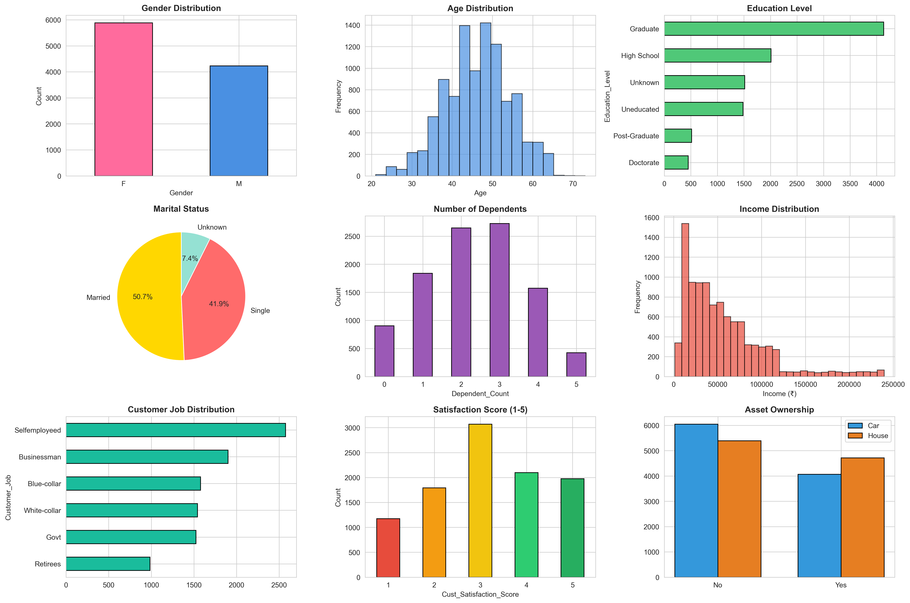
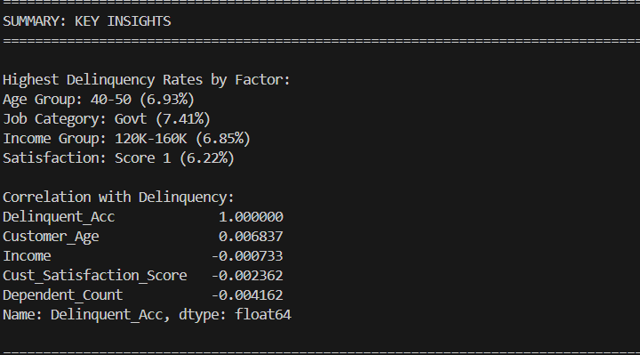

# Customer-Delinquency-Analysis-and-Prediction
Predicting credit card customer delinquency using demographic segmentation and machine learning to enable proactive risk management and portfolio optimization.

---

## 📊 Project Overview

This project analyzes 10,000+ credit card customers to identify high-risk delinquency patterns and build a predictive machine learning model. The analysis reveals key demographic risk drivers and customer behavioral patterns that traditional correlational analysis misses.

**Business Impact:** Early identification of defaulters enables banks to implement targeted intervention strategies, reduce portfolio losses, and optimize credit policies.

---

## 🎯 Problem Statement

Credit card default is a significant source of portfolio risk for financial institutions. Traditional univariate risk assessment fails to capture complex interactions between customer demographics, financial behavior, and satisfaction metrics.

**Key Challenge:** Identify which customers will become delinquent (miss payments 30+ days) before default occurs, enabling proactive credit management.

---

---
.
---
## 📈 Key Findings

### Delinquency Rates by Demographic Segment

| Segment | Delinquency Rate | Key Insight |
|---------|------------------|------------|
| Government Employees | 7.41% | Lowest salary flexibility despite job stability |
| Age 40-50 | 6.93% | Peak default risk demographic |
| Income $120K-$160K | 6.85% | Mid-high earners show lifestyle inflation risk |
| Satisfaction Score 1 | 6.22% | Dissatisfied customers 4x more likely to default |

### Surprising Discoveries

- **Income Paradox:** Higher income groups (120K-160K) show MORE defaults than lower income, suggesting behavioral over circumstantial risk
- **Weak Linear Correlations:** Individual demographic factors show near-zero correlation with delinquency, indicating **complex nonlinear patterns** requiring tree-based models
- **Job Category Impact:** Government employees outrank other categories despite traditional "stable job" assumption

---

## 🔍 Analysis Methodology

### Phase 1: Exploratory Data Analysis
- Merged 10,000 customer records with credit card transaction history
- Analyzed 15+ demographic and behavioral features
- Identified missing values and data quality issues

### Phase 2: Demographic Segmentation
- Created age groups, income brackets, and satisfaction buckets
- Calculated delinquency rates for each segment
- Identified high-risk customer personas

### Phase 3: Statistical Analysis
- Computed correlation matrix between features and delinquency
- Discovered weak individual correlations (r < 0.01)
- Determined need for nonlinear ML approach

