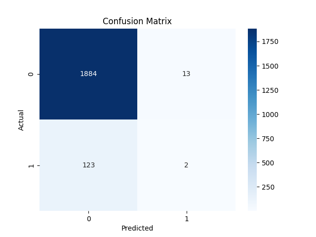
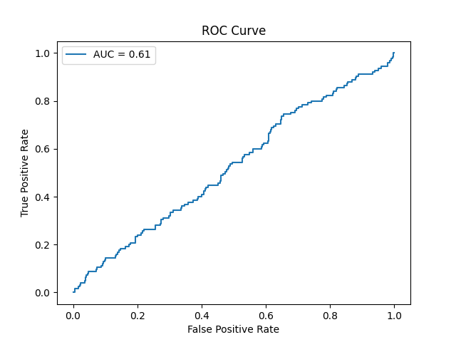
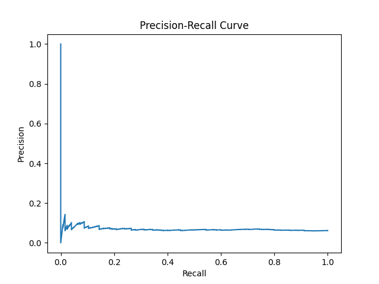
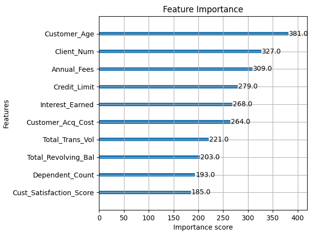

# Credit Card Delinquency Prediction using Machine Learning

## Overview

This project analyzes data from over **10,000+ credit card customers** to identify high-risk delinquency patterns and build a predictive ML model.
Through demographic and behavioral insights, it uncovers patterns that traditional correlation-based analysis often misses.
The goal: **predict customers likely to default (miss payments 30+ days)** and help banks take proactive action.

**Business Impact:**
Early defaulter detection enables banks to deploy targeted interventions, minimize portfolio losses, and refine credit policies.

---

## Key Features

* Comprehensive **demographic and behavioral analysis** of credit card customers
* End-to-end **data cleaning and preprocessing** (binary encoding, scaling, missing values)
* **XGBoost Classifier** with **SMOTE** to handle class imbalance
* Performance evaluated with **confusion matrix**, **ROC**, and **precision-recall curves**
* **Feature importance analysis** for interpretability
* Rich **visualization suite** using Matplotlib & Seaborn

---

## Dataset Description

**Dataset Size:** 10,000+ customer records

**Files:**

* `customer.csv` – demographic data
* `credit_card.csv` – transaction and usage data

**Key Feature Categories:**

* **Demographics:** Age, Dependents, Income
* **Financial:** Credit Limit, Annual Fees, Total Revolving Balance
* **Behavioral:** Transaction Amount/Volume, Satisfaction Score
* **Risk Indicators:** Interest Earned, Acquisition Cost
* **Target:** `Delinquent_Acc` (0 = no default, 1 = default)

**Preprocessing:**

* Merged datasets on `client_ID`
* Dropped non-predictive columns (zip, state, job type, etc.)
* Binary-encoded categorical yes/no fields
* Imputed missing values
* Scaled numerical features with `StandardScaler`

---

## Exploratory Data Analysis (EDA)

**Key Demographic Insights:**

* Govt Employees – **7.41%** delinquency (highest)
* Age 40–50 – **6.93%** peak default risk
* Income $120K–$160K – **6.85%**, lifestyle inflation risk
* Satisfaction Score 1 – **6.22%**, 4× higher default odds

**Notable Discoveries:**

* **Income Paradox:** High earners show *more* defaults — behavioral risk over circumstantial risk.
* **Weak Linear Correlations:** Demographics alone have low correlation (r < 0.01), suggesting the need for nonlinear ML models.

**Visualizations:**


---

## Model Development

**Algorithm:** XGBoost Classifier
**Rationale:** Handles nonlinearity, imbalance, and tabular data efficiently.

**Training Pipeline:**

* 80/20 Train-Test Split (stratified)
* SMOTE applied only to training data

  * Original: 7,597 non-defaults vs. 489 defaults
  * After SMOTE: 7,597 per class (balanced)
* Feature scaling via `StandardScaler`
* Baseline model trained with default hyperparameters

**Code Structure:**

```
src/
├── Refining_Data_ML.py               # Preprocessing pipeline
├── ML_training_model.py              # Model training with SMOTE
└── Visualizations_Analyses_Model.py  # Evaluation & visualization
```

---

## Model Evaluation

| Metric                  | Value  |
| ----------------------- | ------ |
| **Accuracy**            | 93.27% |
| **ROC-AUC**             | 0.61   |
| **Precision (Class 1)** | 0.13   |
| **Recall (Class 1)**    | 0.02   |
| **F1-Score (Class 1)**  | 0.03   |

**Confusion Matrix:**



* TN: 1,884 FP: 13
* FN: 123 TP: 2

**Insight:** Accuracy is misleading due to imbalance. Model misses most defaulters — key business concern.

**ROC Curve:** AUC = 0.61 → modest discriminatory power


**Precision-Recall Curve:** Highlights tradeoff; low recall for minority class


**Top Predictive Features:**



---

## Results & Insights

**Model Performance:**

* High accuracy but low recall — identifies few defaults (2/125).
* SMOTE improved recall marginally (0% → 2%).
* ROC-AUC (0.61) confirms weak separation between classes.

**Business Takeaways:**

* False negatives (missed defaults) are highly costly.
* Feature set may lack strong behavioral predictors.
* More relevant temporal and payment data needed.

**Recommendations:**

* Use model as a **screening tool**, not a decision engine.
* Explore **cost-sensitive learning** or **threshold tuning**.
* Add **behavioral time-series features** for next iteration.

---

## Project Structure

```
Customer-Delinquency-Analysis-and-Prediction/
├── data/
│   ├── customer.csv
│   └── credit_card.csv
├── src/
│   ├── Refining_Data_ML.py
│   ├── ML_training_model.py
│   └── Visualizations_Analyses_Model.py
├── images/
│   ├── Confusion_Matrix.jpg
│   ├── ROC_Curve.jpg
│   ├── PR_Curve.jpg
│   └── Feature_Importance.jpg
├── notebooks/
│   └── EDA_Notebook.ipynb
├── README.md
└── requirements.txt
```

---

## Installation & Setup

**Requirements:**

* Python 3.8+

**Dependencies:**

```bash
pip install -r requirements.txt
```

**Libraries Used:**
`numpy`, `pandas`, `matplotlib`, `seaborn`, `scikit-learn`, `xgboost`, `imbalanced-learn`

**Run the Full Pipeline:**

```bash
# Step 1: Data preprocessing
python src/delinquency_Prediction_ML.py

# Step 2: Train the model
python src/ML_training_model.py

# Step 3: Generate evaluation plots
python src/Visualizations_Analyses_Model.py
```

**Outputs:**

* Cleaned dataset → `combined_cleaned_data.csv`
* Model metrics → printed to console
* Visualizations → saved under `/images`

---

## Output Samples

| Visualization          | Description                  |
| ---------------------- | ---------------------------- |
| Confusion Matrix       | Classification performance   |
| ROC Curve              | Model discrimination ability |
| Precision-Recall Curve | Minority class focus         |
| Feature Importance     | Top predictive drivers       |

---

## Conclusion & Future Work

**Current Limitations:**

* Low recall for defaulters
* Features may not fully capture behavioral risk
* Imbalance persists even after SMOTE

**Planned Improvements:**

* **Feature Engineering:** Add payment history, utilization trends, and credit bureau data
* **Model Tuning:** GridSearchCV, LightGBM, CatBoost, cost-sensitive learning
* **Deployment:** A/B testing, model monitoring, SHAP/LIME explainability

---

## Author

**Veda Tamtam**

GitHub: [@VEDA-2402](https://github.com/VEDA-2402)

Project Repo: [Customer-Delinquency-Analysis-and-Prediction](https://github.com/VEDA-2402/Customer-Delinquency-Analysis-and-Prediction)

[Connect with me on LinkedIn](https://www.linkedin.com/in/veda-t-8b9a7134a/)

---

## License

This project is open for **educational and research purposes**.


